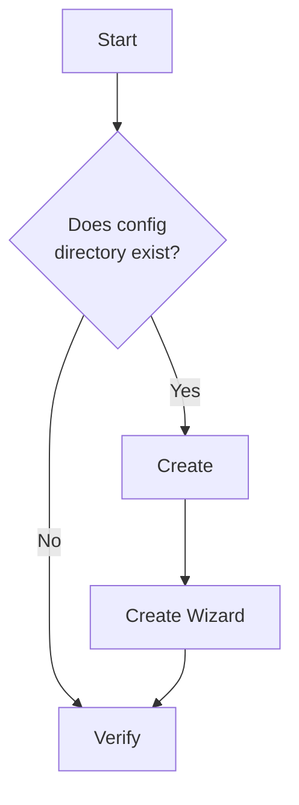

# ConfigManager

The ConfigManager is responsible for ensuring that the local configuration is in good working order. It is also responsible for ensuring that the configuration is in a good state for the current version of the DFM software.

On every startup we execute the following workflow

## Non Responsibilties

Although the ConfigManager is a central part of the DFM software, it is only responsible for making sure the local configuration exists, and is a good enough condition to start the application. It can't be responsible to verify all of the values in the configuration are correct, as this would lead to feature bloat and poor seperation of responsibilties. For example, there are configuration details related to other topics stored in the ConfigManager, but the ConfigManager is not responsible for verifying these values, such as:

* Authentication
* Files being watched
* Versioning
* etc

Other components will use the ConfigManager for persistant storage but, they will be responsible for verifying the values are correct.